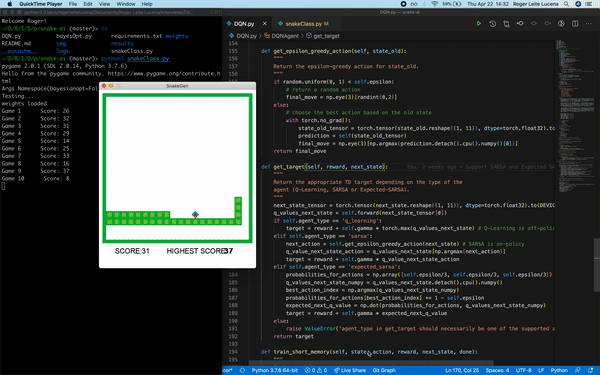

# Deep Reinforcement Learning

## Project: Train AI to play Snake

The goal of this project is to develop an AI bot able to learn how to play the popular game Snake from scratch. In order to do it, we use a Deep Reinforcement Learning algorithm. This approach consists on giving the agent parameters related to its state, and a positive or negative reward based on its actions. No rules about the game are given, and initially the bot has no information on what it needs to do. The goal for the agent is to figure it out and elaborate a strategy to maximize the score - or the reward.

<p align="center">
    
</p>

We will see how a Deep Reinforcement Learning algorithm learns to play Snake, starting from 0 and scoring up to 55 points while showing a solid strategy after only 5 minutes of training (100 games played). Video of the trained agent available [here](https://youtu.be/CGNs8cxwJrc).

In addition to that, it is also possible to run the Bayesian Optimization method to find the optimal parameters of the Deep Neural Network, as well as some parameters of the Deep RL approach.

### Comparing Q-Learning, SARSA and Expected SARSA

You can find here implementations of Q-Learning, SARSA and Expected SARSA, used to compare the algorithms. Some of the results and final conclusions can be found inside the [results](./results) folder.

## Install
This project requires Python 3.6 with the `pygame` library installed, as well as PyTorch. If you encounter any error with `torch=1.7.1`, you might need to install Visual C++ 2015-2019 (or simply downgrade your PyTorch version, it should be fine).

The full list of requirements is in `requirements.txt`.

```bash
git clone git@github.com:rogerlucena/snake-ai.git
```

## Run
To run and show the game, execute in the `snake-ai` folder:

```bash
python snakeClass.py
```

Arguments description:

- `--display` - Type bool, default True, display or not the game view
- `--speed` - Type integer, default 50, game speed

The default configuration loads the file `weights/weights.h5` (trained with Expected SARSA on 100 games, best performance among the three algorithms) and runs a test.

To train the agent, set in the file `snakeClass.py`:

- `params['train'] = True`

The parameters of the Deep Neural Network can be changed in `snakeClass.py` by modifying the dictionary `params` in the function `define_parameters()`.

You can also personalize the algorithm being used for training through the string variable `params['agent_type']` there. The currently supported options are `'q_learning'`, `'sarsa'` and `'expected_sarsa'`.

Finally, if you run `snakeClass.py` from the command line you can set the arguments `--display=False` and `--speed=0`. This way, the game display is not shown and the training phase is faster.

## Optimize Deep RL with Bayesian Optimization
To optimize the Deep Neural Network and additional parameters, run:

```bash
python snakeClass.py --bayesianopt=True
```

This method uses Bayesian Optimization to optimize some parameters of Deep RL. The parameters and the features' search space can be modified in `bayesOpt.py` by editing the `optim_params` dictionary in `optimize_RL`.

## For Mac users
It seems there is a OSX specific problem, since many users cannot see the game running.
To fix this problem, in `update_screen()`, add this line.

```python
def update_screen():
    pygame.display.update() <br>
    pygame.event.get() # <--- Add this line ###
```

## References

This project is based on [this](https://towardsdatascience.com/how-to-teach-an-ai-to-play-games-deep-reinforcement-learning-28f9b920440a) article, for which the original code can be found [here](https://github.com/maurock/snake-ga) (PyTorch) or in its older version [here](https://github.com/maurock/snake-ga-tf) (Keras/TensorFlow).
